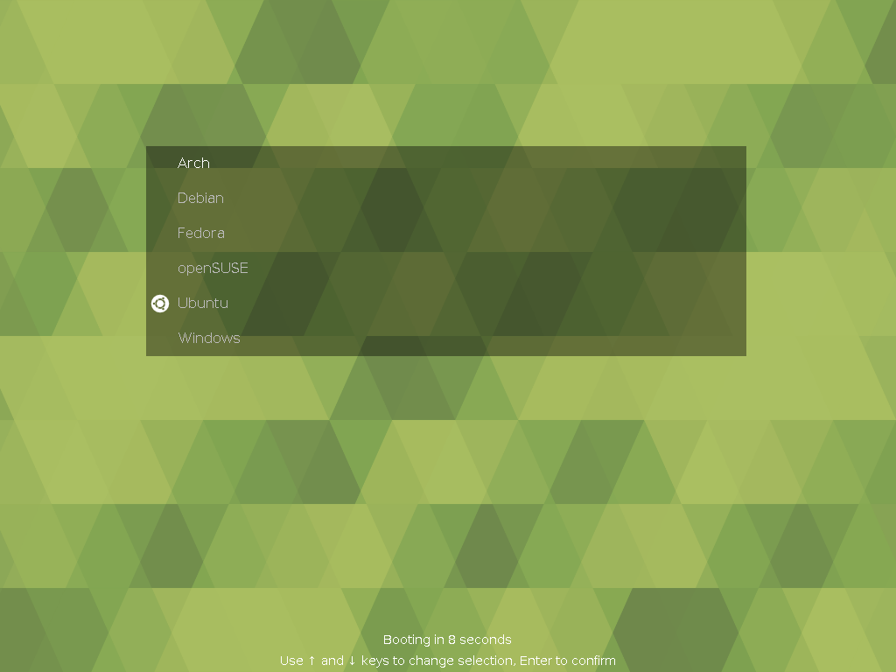

## Ubuntu MATE GRUB Theme

Supported languages: Chinese (simplified), English, French, German, Italian, Norwegian, Portuguese, Russian, Spanish, Ukrainian


---

### Installation / update

1. **Secure way:**
    - Download install script:  
    `wget -P /tmp https://github.com/RobLoach/ubuntu-mate/raw/master/install.sh`
    - Review install script at `/tmp/install.sh`
    - Run it: `bash /tmp/install.sh`

2. **Easier, less secure way** — just download and run install script:  
    `wget -O - https://github.com/RobLoach/ubuntu-mate/raw/master/install.sh | bash`

---

### See also

- [GRUB Customizer](https://launchpad.net/grub-customizer) if you want to change GRUB settings through a GUI
- [Poly light GRUB theme](https://github.com/shvchk/poly-light)
- [Poly dark GRUB theme](https://github.com/shvchk/poly-dark)
- [Fallout GRUB theme](https://github.com/shvchk/fallout-grub-theme)

### Development

This is built from [poly-light](https://github.com/shvchk/poly-light), to update it...
```
git pull https://github.com/shvchk/poly-light.git master
```